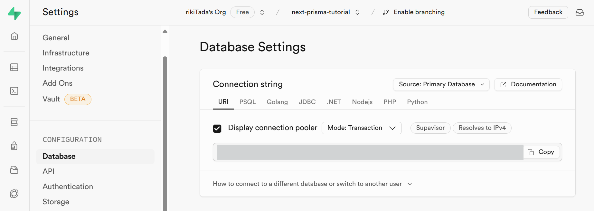

## Develop Guide

### 環境構築

#### インストール

```bash
npx create-next-app@latest --typescript
bun add --dev prisma
npx prisma init
```

#### テーブル作成

```prisma
// sample
model User {
  id    Int    @id @default(autoincrement())
  name  String
  posts Post[]
}

model Post {
  id        Int     @id @default(autoincrement())
  title     String
  published Boolean @default(true)
  authorId  Int
  author    User    @relation(fields: [authorId], references: [id])
}
```

#### 環境変数の設定

`DATABASE_URL=""` をsupabaseの(project-settings)URLに変更。
※ Mode: Session


#### マイグレーション

```bash
npx prisma migrate dev --name init
```
